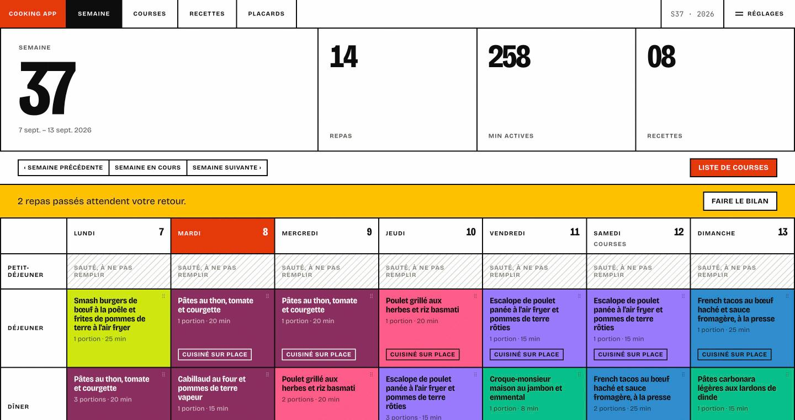
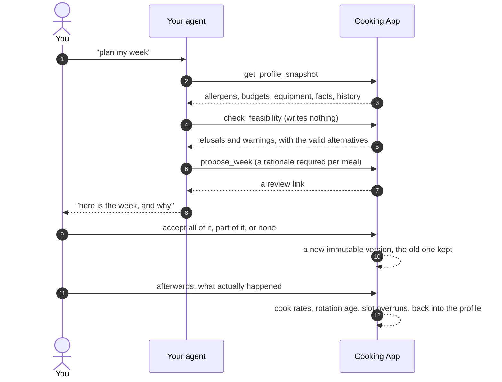
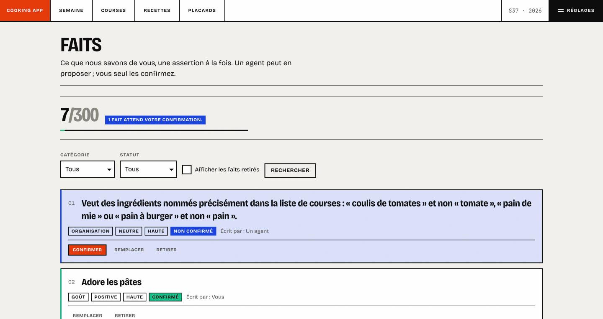
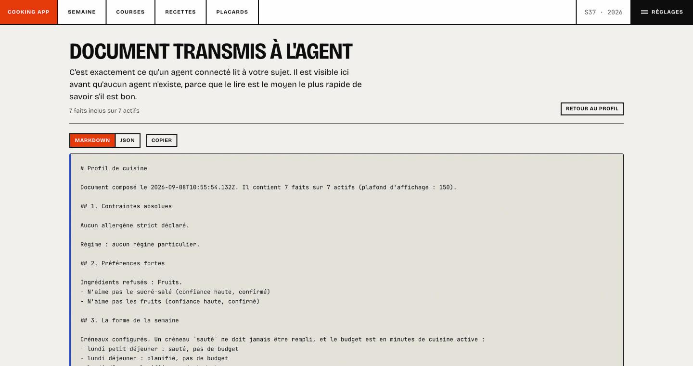
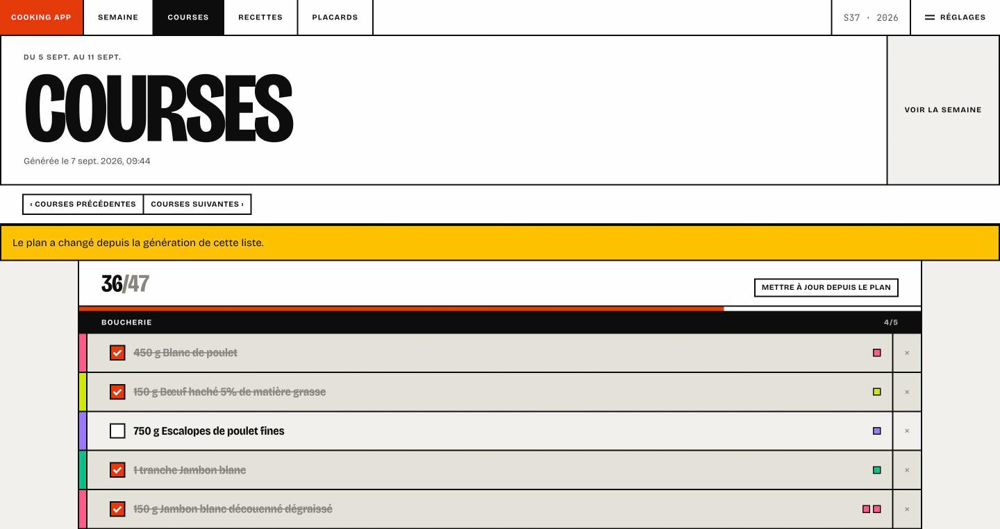
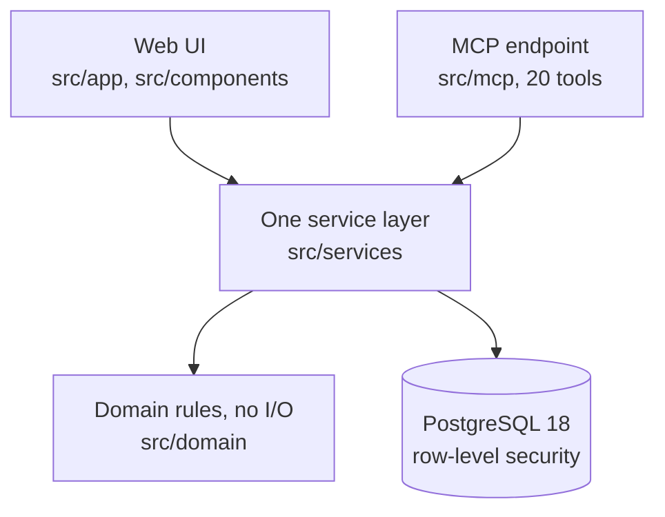

<div align="center">


# Cooking App

**A weekly cooking planner that your own AI agent plans for you.**

Self-hosted. The application never calls a language model. The intelligence
comes from the agent you already pay for, connected over MCP.

[](https://github.com/LSRaGeUx/cooking-app/actions/workflows/ci.yml)


[What it is](#what-it-is) · [How it works](#how-it-works) · [Screens](#screens) ·
[The live instance](#the-live-instance) · [Run your own](#run-your-own) ·
[Connect an agent](#connect-an-agent) · [How it is built](#how-it-is-built) ·
[Docs](docs/README.md)



<sub>Week 37. Fourteen meals, 258 minutes of active cooking, planned by an agent
over MCP. Breakfast is a `sauté` slot, so nothing may fill it.</sub>

</div>

---

## What it is

Most meal planners hold recipes. This one holds a **structured, durable profile
of one cook**: allergens with severity, diet, equipment, how much active cooking
each slot of the week can absorb, and an open store of facts about what that
person actually likes, avoids and does.

That profile is exposed over the Model Context Protocol, so a general purpose
agent can read it, plan a week against it, and write back what it learned. You
approve or reject the result slot by slot.

**No language model runs on the server, and none ever will.** There is no API
key to buy and no per user inference cost. A dependency check in CI fails the
build if an LLM client so much as enters the lockfile. Any feature that seems to
need a model gets restructured as a tool your agent calls instead.

The application is fully usable with no agent connected. Plan the week by hand
and it is an ordinary, pleasant planner. Connect an agent and it becomes the
thing it was built for.

## How it works



Every meal an agent proposes must say why it is there and cite the facts that
drove it, so when the week is wrong you can correct the cause rather than the
dish. Rejections are kept with your reason and fed back.

**Nothing an agent does is irreversible.** Plan versions are immutable and
revertible. Facts are retired, not deleted, and can be restored. Pantry
removals and recipe deletions are soft for thirty days. Agent written facts
arrive `unconfirmed` and only a human confirms one.

## Screens

Real screens from a real week, not mockups. The interface is French.

### Facts, and who wrote them



The rule above, on screen. The first fact was written by an agent, so it carries
`NON CONFIRMÉ` and does nothing until a human presses **Confirmer**. The second
was written by the cook and is already in force. An agent may propose anything;
it may not decide that you believe it.

### The document your agent reads



Not a settings page. This is the composed context an agent receives about the
cook, in the exact form it is sent, as Markdown or JSON. Absolute constraints
first, since a strict allergen is the one thing no path may override, then
preferences with a confidence, then the shape of the week. Reading it is the
fastest way to judge whether the context is any good, which is why it is a
screen rather than an export.

### Groceries



Built from the plan for a shopping cycle and grouped by aisle. Regeneration
merges rather than wipes: 36 of 47 lines are already ticked and stay ticked, and
the banner says the plan has moved since this list was generated rather than
quietly rewriting it under you. The colour strip on each line is the meal the
line was bought for.

## The live instance

There is one running at **[cooking.yanadam.fr](https://cooking.yanadam.fr)**.

It is my own kitchen, not a product launch. It exists for two reasons: so I can
plan a week from whatever device I have on me, and so the way it is built can be
shown to someone rather than described.

**Access is per account and closed by default.** There is no sign up page, and
an address that is not on the instance allowlist cannot create an account even
after a successful Google sign in, because proving who you are is not the same
as being allowed in. If you want to look around, open an issue and ask, and be
aware of what you are asking for: this is a personal tool exposed to the
internet, not a multi-tenant service with a support rota. Every account shares
one Postgres instance, separated by row-level security and a `user_id` predicate
on every query, which is tested, but it has an audience of one and is budgeted
like it.

If you want it for real, run your own. That is the supported path and the next
section is how.

## What you get

|                   |                                                                                                                                                                                 |
| ----------------- | ------------------------------------------------------------------------------------------------------------------------------------------------------------------------------- |
| **The week**      | A seven day grid of the meal types you define, drag and drop, fully operable from a keyboard, with a per slot budget for active cooking time that the server enforces.          |
| **Recipes**       | Your own library, with photos, revisions on every edit, and import from a URL by reading the schema.org data already in the page.                                               |
| **Groceries**     | Generated from the plan for a shopping cycle, merged rather than wiped on regeneration: what you ticked stays ticked, hand added lines survive, and the screen says what moved. |
| **Safety**        | Allergens with severity. A `strict` allergen is an absolute block on every write path, UI and agent alike, with no override anywhere.                                           |
| **The profile**   | The exact document your agent reads, viewable in the app as Markdown or JSON. Reading it is the fastest way to judge whether the context is any good.                           |
| **Feedback**      | One screen for the whole week, never a modal. It feeds search ranking, rotation, and a suggestion when a time budget stops matching your kitchen.                               |
| **Prep**          | Declare that Sunday's cooking feeds Tuesday's dinner. The shopping scales the session once instead of buying twice.                                                             |
| **Offline**       | Installs to the home screen. The grocery list is the one screen that works with no signal: a tick that cannot reach the server is queued and replayed, never silently reverted. |
| **Your data**     | Export everything as one JSON file. Delete the account for real, across every table.                                                                                            |
| **Two languages** | French and English, with a test that fails when the two catalogues drift apart.                                                                                                 |

## Run your own

This is the path that matters: the product is something you host. You need a
machine with Docker and a hostname pointed at it. **The server never builds.**
CI publishes an image per commit, so a deploy is a pull.

```sh
git clone https://github.com/LSRaGeUx/cooking-app.git && cd cooking-app
cp .env.example .env          # fill in the values it refuses to start without
echo "$GHCR_TOKEN" | docker login ghcr.io -u <you> --password-stdin

docker compose -f compose.yaml -f deploy/compose.proxy.yaml --profile serve pull
docker compose -f compose.yaml -f deploy/compose.proxy.yaml \
  --profile serve up -d --no-build --wait
```

That migrates the database, starts the application, and gets a certificate from
Let's Encrypt. Then open your hostname, sign in, and you land on the current
week, seeded with three meal types and a starter ingredient vocabulary so
grocery merging and allergen matching work from your first recipe.

> [!IMPORTANT]
> **`--profile serve` on both commands, every time.** Without it Compose
> considers only the services in no profile, which is the database alone, and
> then reports success: the application keeps serving whatever image it was
> already on. That is a deploy that looks finished and changed nothing, and it
> has happened here for real. The only trustworthy confirmation is the `up`
> output naming all three services.

Leave the proxy overlay out if the machine already terminates TLS on ports 80
and 443, and leave it out until DNS actually resolves to the machine either way,
since failed Let's Encrypt challenges count against that hostname's rate limit.

Secrets can be mounted as files rather than passed as environment, through
`deploy/compose.secrets.yaml`, which keeps them out of `docker inspect`.

[**docs/08-self-hosting.md**](docs/08-self-hosting.md) covers configuration, the
registry token, the two database roles, TLS, backups, upgrades, rollback and
troubleshooting.

## Develop on it

Node per `.nvmrc`, and Podman or Docker for PostgreSQL 18.

```sh
cp .env.example .env          # then set BETTER_AUTH_SECRET
npm ci
npm run db:setup              # container, roles, migrations, auth tables, side databases
npm run verify                # deps, format, lint, typecheck, tests
npm run dev                   # http://127.0.0.1:3000
```

`verify` is exactly what CI runs, and each step stands alone: `check:deps`,
`format:check`, `lint`, `typecheck`, `test`. Also `format`, `lint:fix` and
`test:coverage`.

`npm run dev` binds loopback deliberately. A development server with an open
allowlist and password sign in is an unauthenticated sign up door, and it has no
business on whatever network the laptop is on.

`verify` needs nothing but Postgres, so it stays runnable in CI. The agent
connection path needs a real HTTP server, so it has a check of its own:

```sh
npm run dev:test              # in one terminal, port 3100, its own database
npm run verify:oauth          # in another
```

That walks what a real MCP client does, in order: cold dynamic client
registration, an authorization request with PKCE, login, consent, the code
exchange, an authenticated call, scope enforcement, revocation taking effect
before the token expires, and a final check that an unauthenticated call is
still refused with RFC 9728 discovery.

## Connect an agent

The endpoint is `/api/mcp`, and the app's Agent screen walks a client through
connecting to it. Paste one URL, approve the consent screen, and say "plan my
week".

**Twenty tools, eight resources, two prompts** carrying the recommended call
sequence.

<table>
<tr><th align="left">Read</th><th align="left">Write</th></tr>
<tr valign="top"><td>

`whoami`<br>
`get_profile_snapshot`<br>
`search_recipes`<br>
`get_recipe`<br>
`get_week`<br>
`get_history`<br>
`get_pantry`<br>
`check_feasibility`

</td><td>

`propose_week`<br>
`update_slot`<br>
`create_recipe`<br>
`update_recipe`<br>
`import_recipe_from_url`<br>
`record_facts`<br>
`retire_fact` · `restore_fact`<br>
`add_pantry_items` · `remove_pantry_item` · `restore_pantry_item`<br>
`link_prep`

</td></tr>
</table>

`check_feasibility` sits with the reads because it takes exactly what
`propose_week` takes and writes nothing. It is how an agent iterates against the
validation rules before committing to them. The three restore tools exist
because nothing an agent does may be irreversible.

Access is per client: scoped, rate limited, audited, and revocable with
immediate effect rather than whenever the token happens to expire.

Every parameter is snake_case at every depth and carries a description, and a
test fails if one does not. Tools and resources return the same shape for the
same entity, so a week read from `cooking://plan/current` can be handed straight
to `link_prep`.

Full surface, the error taxonomy, and the reasoning behind both:
[**docs/03-agent-interface.md**](docs/03-agent-interface.md).

## How it is built

TypeScript end to end. Next.js, PostgreSQL 18, Drizzle, Better Auth acting as a
full OAuth 2.1 provider, the MCP TypeScript SDK, Zod as the single source of
validation, next-intl, dnd-kit, and linkedom for reading recipes out of a page.



That shape is the point, not an accident. **A rule may not exist in only one
entry point**, so no business logic lives in a route handler, a server action or
a React component. A lint rule enforces it: the UI and MCP layers cannot import
the database at all.

Every query against a user owned table is scoped by `user_id` in the query
itself, with row-level security as a second line rather than the only one. A
query that forgets the scope returns zero rows instead of another tenant's, and
a test enumerates every such table to keep that true as tables are added.

The decisions, including the alternatives that were rejected and why, are in
[**docs/04-tech-spec.md**](docs/04-tech-spec.md).

### The five constraints

1. **No server-side LLM call, ever.** Enforced in CI against the lockfile and by
   scanning the source for provider hostnames.
2. **Strict allergens are an absolute block** on every write path, with no
   override on any of them.
3. **One service layer** behind both the UI and the agent surface.
4. **Nothing an agent does is irreversible.**
5. **The app is fully usable with no agent connected.**

## Docs

The specification is the source of truth and it is kept current with the code.
Start at [**docs/README.md**](docs/README.md), then read in order.

|                                                    |                                                             |
| -------------------------------------------------- | ----------------------------------------------------------- |
| [00-vision](docs/00-vision.md)                     | Scope in and out, the cost model, the risks                 |
| [01-functional-spec](docs/01-functional-spec.md)   | Vocabulary, feature rules, screens, edge cases              |
| [02-data-model](docs/02-data-model.md)             | Entities, invariants, tenancy                               |
| [03-agent-interface](docs/03-agent-interface.md)   | Tools, resources, the snapshot, the error taxonomy          |
| [04-tech-spec](docs/04-tech-spec.md)               | Stack, architecture, security, recorded decisions           |
| [05-roadmap](docs/05-roadmap.md)                   | The phases, all shipped, and what each one settled          |
| [06-open-questions](docs/06-open-questions.md)     | Assumptions, unknowns, and the known gaps                   |
| [07-phase-0-findings](docs/07-phase-0-findings.md) | What the spike proved about OAuth, MCP, RLS and Postgres 18 |
| [08-self-hosting](docs/08-self-hosting.md)         | Running it for real                                         |

## Status

All ten phases shipped, and the loop is closed end to end. The most recent work
was a full code quality audit of the repository and the remediation of
everything it found, which is recorded under _Audit_ in
[docs/05-roadmap.md](docs/05-roadmap.md).

## Licence

**[PolyForm Noncommercial 1.0.0](LICENSE.md).** Read it, run it, change it,
fork it, host your own copy, share your changes, for any noncommercial purpose.
That explicitly includes personal use, hobby projects, study and research, and
use by a charity, a school or a public body whatever their funding.

**Commercial use needs written permission from me.** Open an issue and ask.

One honest caveat about a word that gets used loosely. This licence is
_source-available_, not _open source_: the Open Source Definition does not allow
a restriction on the field of use, so any noncommercial clause sits outside it
by definition. Everything else people usually mean by open source does hold
here. Nothing is hidden, forks are welcome, and the specification in `docs/` is
public precisely so the thing can be learned from.
